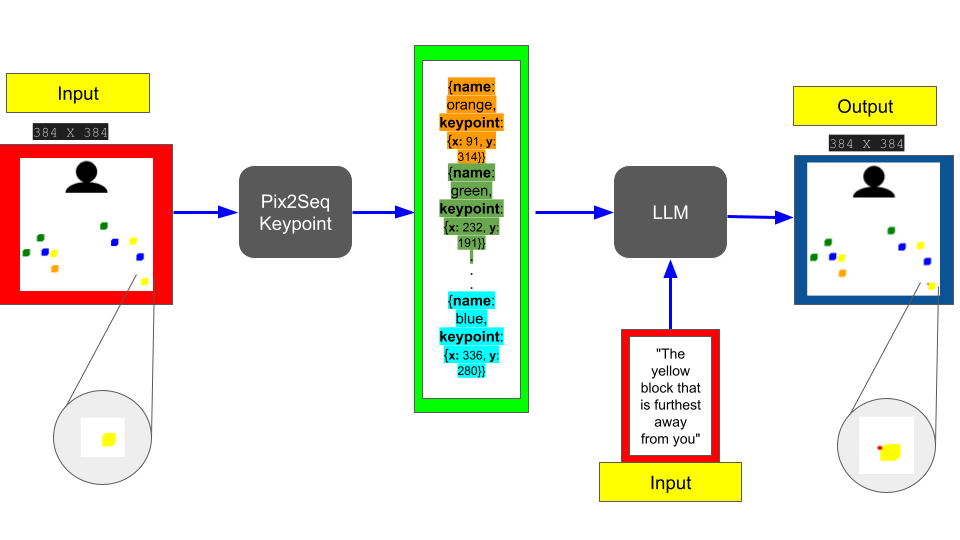

# PixLMDetect: A Robotics Visual Perception Enhancement Model

The goal of this project is to enhance perception capabilities of robots by fine tuning a multimodal vision-language model.
Note: inside each directory, there is a readme discussing the files and purpose of the files in that directory. 

Please see the video of our project here:
[Insert video here]

# Model Architecture:

<figure>
  
  <figcaption><strong>Figure 1: Architecture for Robot Perception Enhancement Model.</strong> The input is the image and the instruction for the model to locate the correct box in the image. The model will first generate a text description of the image, providing the coordinates for all of the blocks in the image as well as their color. This is done by the keypoint detection model that is inspired from the Pix2Seq model [1]. The output of Pix2Seq and the instruction input will be given to the fine tuned Large Language Model [2]. The output will be a dictionary of the x and y keypoint coordinates that the model gives with high confidence to be the correct location of the image and is plotted on the original figure.</figcaption>
</figure>

# Basic setup before running the code

The following setup is required before running the code.

```
git clone https://github.com/Yasamin-Nourijelyani/multimodal_robotics.git

cd multimodal_robotics

pip install -r requirements.txt
```


## Running Code on Your Examples

Note: please connect to a 15G or higher RAM GPU (even for inference).

Note: the model can take up to 1 minute for inference.

Note: the model assumes input images are 384 by 384 px. 

In ```src/model.py``` update the 

```instruction```: the text description of the instruction

```img_path```: the path to the image corresponding to the instruction

```keypoint_img_path```: Location for where to save the image with the keypoint as predicted by the model on the image coresponding to the instruction.   

### Run
```
python3 -m src.run
```

# Citations
[1] Pix2Seq
[2] Mistral7B


